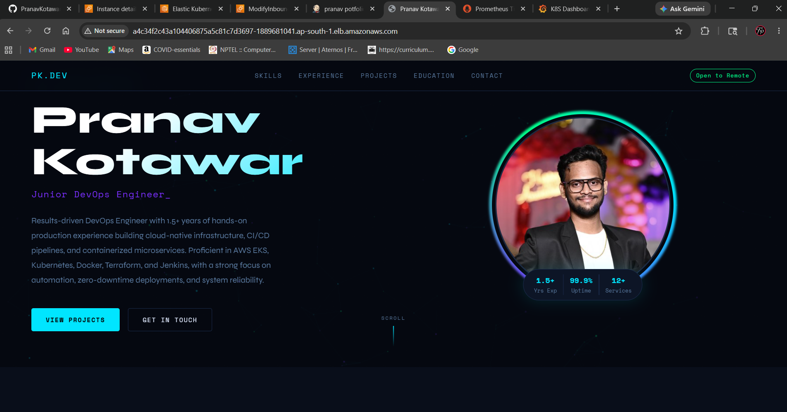
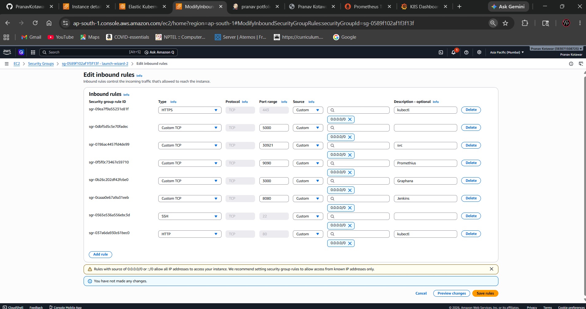
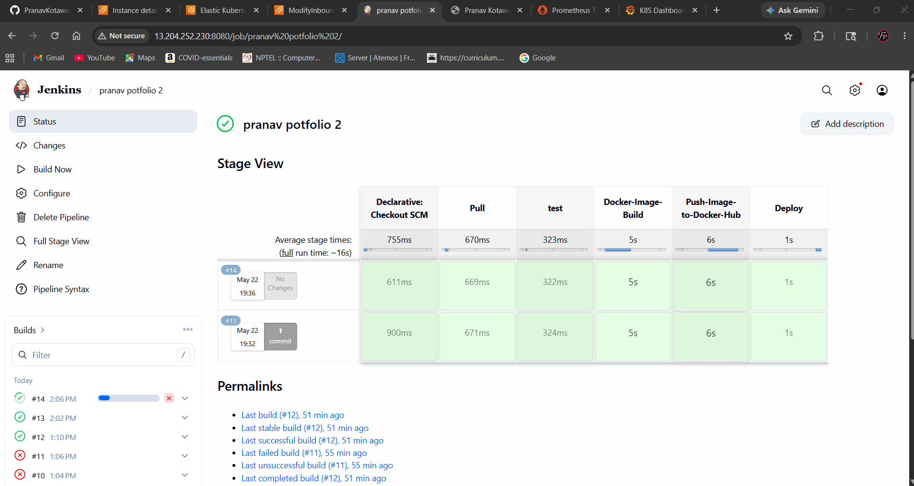
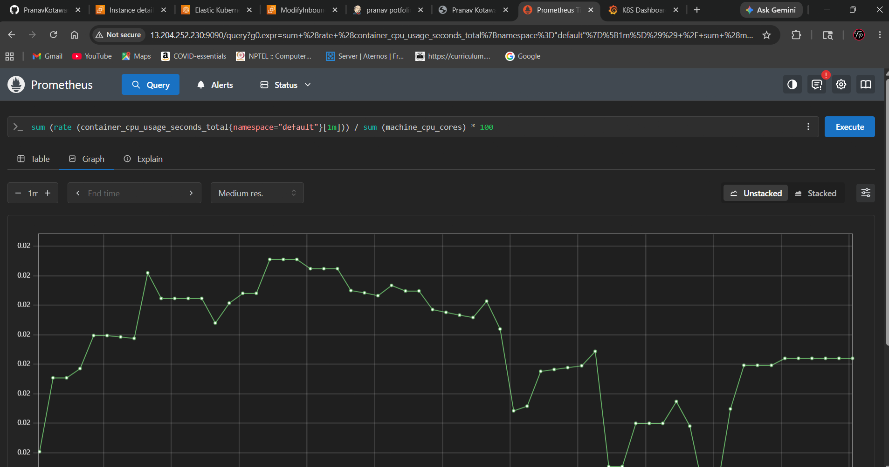
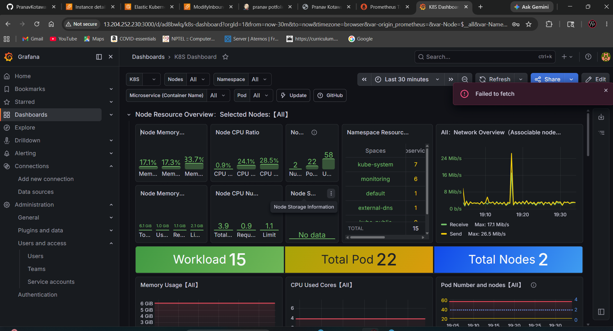

# 🚀 Pranav Kotawar Portfolio Website Deployment on AWS EKS using Jenkins, Docker, Kubernetes, Prometheus & Grafana

---

# 📌 Project Overview

This project demonstrates a complete end-to-end DevOps CI/CD pipeline for deploying a containerized Python-based portfolio website on an Amazon EKS cluster using modern cloud-native technologies.

The project covers:

- CI/CD automation using Jenkins
- Docker containerization
- Kubernetes deployment on AWS EKS
- Monitoring using Prometheus
- Visualization using Grafana
- DockerHub integration
- Cloud-native deployment workflow

This project is beginner-friendly and explains every step required to deploy a production-style application.

---

# 🏗️ Project Architecture

```text
Developer
    ↓
GitHub Repository
    ↓
Jenkins Pipeline
    ↓
Docker Image Build
    ↓
DockerHub Registry
    ↓
Amazon EKS Cluster
    ↓
Kubernetes Deployment
    ↓
Prometheus Monitoring
    ↓
Grafana Dashboard
```

---

# 📂 Project Structure

```bash
ASSIGNMENT/
│
├── kubernetes/
│   ├── HPA.yaml
│   ├── k8s-deployment.yaml
│   └── k8s-service.yaml
│
├── static/
│   └── images/
│       ├── pk.png
│       ├── graphana.png
│       ├── jenkins.png
│       ├── promethius.png
│       ├── website.png
│       ├── security_group.png
│
├── templates/
│   └── index.html
│
├── .env
├── app.py
├── Dockerfile
├── pipeline.groovy
├── README.md
└── requirements.txt
```

---

# ⚙️ Tech Stack

| Technology | Purpose                       |
| ---------- | ----------------------------- |
| Python     | Portfolio Website Development |
| Docker     | Containerization              |
| Jenkins    | CI/CD Automation              |
| Kubernetes | Container Orchestration       |
| Amazon EKS | Managed Kubernetes Cluster    |
| DockerHub  | Docker Image Registry         |
| Helm       | Kubernetes Package Manager    |
| Prometheus | Monitoring & Metrics          |
| Grafana    | Dashboard Visualization       |
| AWS CLI    | AWS Resource Management       |
| kubectl    | Kubernetes Cluster Management |

---

# ☁️ AWS EC2 Setup

## 📌 EC2 Instance Configuration

Create an Ubuntu EC2 instance with the following configuration:

| Configuration    | Value          |
| ---------------- | -------------- |
| Instance Type    | c7i-flex.large |
| Operating System | Ubuntu 24.04   |
| Storage          | 20 GB GP3      |
| Region           | ap-south-1     |

---

# 🔐 Security Group Configuration

Allow the following inbound traffic:

| Port  | Purpose             |
| ----- | ------------------- |
| 22    | SSH Access          |
| 80    | HTTP                |
| 443   | HTTPS               |
| 3000  | Grafana             |
| 5000  | Flask Application   |
| 8080  | Jenkins             |
| 9090  | Prometheus          |
| 30921 | Kubernetes NodePort |

---

# 🛠️ Step 1:- Update Ubuntu Packages

```bash
sudo apt update && sudo apt upgrade -y
```

---

# ☕ Step 2:- Install Java

Jenkins requires Java to run.

## Install Java

```bash
sudo apt install fontconfig openjdk-21-jre -y
```

## Verify Java Installation

```bash
java --version
```

---

# 🛠️ Step 3:- Install Jenkins

## Add Jenkins Repository

```bash
sudo wget -O /etc/apt/keyrings/jenkins-keyring.asc \
https://pkg.jenkins.io/debian/jenkins.io-2026.key
```

```bash
echo "deb [signed-by=/etc/apt/keyrings/jenkins-keyring.asc]" \
https://pkg.jenkins.io/debian binary/ | sudo tee \
/etc/apt/sources.list.d/jenkins.list > /dev/null
```

## Install Jenkins

```bash
sudo apt update
sudo apt install jenkins -y
```

## Start Jenkins

```bash
sudo systemctl start jenkins
```

## Enable Jenkins

```bash
sudo systemctl enable jenkins
```

## Verify Jenkins Status

```bash
sudo systemctl status jenkins
```

---

# 🌐 Step 4:- Access Jenkins Dashboard

Open browser:

```text
http://<EC2-PUBLIC-IP>:8080
```

## Get Jenkins Initial Password

```bash
sudo cat /var/lib/jenkins/secrets/initialAdminPassword
```

- Copy password
- Paste into Jenkins UI
- Install suggested plugins
- Create Jenkins admin user

---

# 🐳 Step 5:- Install Docker

## Install Docker

```bash
sudo apt install docker.io -y
```

## Start Docker

```bash
sudo systemctl start docker
```

## Enable Docker

```bash
sudo systemctl enable docker
```

## Add Current User to Docker Group

```bash
sudo usermod -aG docker $USER
```

## Activate Docker Group

```bash
newgrp docker
```

## Give Jenkins Permission to Access Docker

```bash
sudo usermod -aG docker jenkins
```

## Verify Docker Installation

```bash
docker --version
```

---

# 🔐 Step 6:- Login to DockerHub

```bash
docker login
```

Enter:

- DockerHub Username
- DockerHub Password

---

# ☁️ Step 7:- Install AWS CLI

## Download AWS CLI

```bash
curl "https://awscli.amazonaws.com/awscli-exe-linux-x86_64.zip" -o "awscliv2.zip"
```

## Install unzip

```bash
sudo apt install unzip -y
```

## Extract AWS CLI

```bash
unzip awscliv2.zip
```

## Install AWS CLI

```bash
sudo ./aws/install
```

## Verify AWS CLI

```bash
aws --version
```

---

# 🔑 Step 8:- Configure AWS CLI

```bash
aws configure
```

Provide:

- AWS Access Key
- AWS Secret Key
- Region Name
- Output Format

---

# 📁 Step 9:- Give Jenkins Access to AWS Credentials

```bash
cp -rv .aws/ /var/lib/jenkins/
```

```bash
sudo chown -R jenkins /var/lib/jenkins/.aws/
```

---

# ☸️ Step 10:- Install kubectl

## Download kubectl

```bash
curl -LO "https://dl.k8s.io/release/$(curl -L -s https://dl.k8s.io/release/stable.txt)/bin/linux/amd64/kubectl"
```

## Install kubectl

```bash
sudo install -o root -g root -m 0755 kubectl /usr/local/bin/kubectl
```

## Verify kubectl

```bash
kubectl version --client
```

---

# ☁️ Step 11:- Connect EC2 to EKS Cluster

```bash
aws eks update-kubeconfig --name <cluster-name> --region <region>
```

Example:

```bash
aws eks update-kubeconfig --name portfolio-cluster --region ap-south-1
```

## Verify Connection

```bash
kubectl get nodes
```

---

# 📁 Step 12:- Give Jenkins Access to Kubernetes Cluster

```bash
sudo cp -rv .kube/ /var/lib/jenkins/
```

```bash
sudo chown -R jenkins /var/lib/jenkins/.kube/
```

---

# ⛵ Step 13:- Install Helm

## Install Helm

```bash
curl -fsSL -o get_helm.sh https://raw.githubusercontent.com/helm/helm/main/scripts/get-helm-3
```

```bash
sudo chmod 700 get_helm.sh
```

```bash
./get_helm.sh
```

## Verify Helm

```bash
helm version
```

---

# 📊 Step 14:- Install Prometheus and Grafana

## Add Helm Repository

```bash
helm repo add prometheus-community https://prometheus-community.github.io/helm-charts
```

```bash
helm repo add stable https://charts.helm.sh/stable
```

## Update Helm Repo

```bash
helm repo update
```

## Create Monitoring Namespace

```bash
kubectl create namespace monitoring
```

## Install kube-prometheus-stack

```bash
helm install kind-prometheus prometheus-community/kube-prometheus-stack \
--namespace monitoring \
--set prometheus.service.nodePort=30000 \
--set prometheus.service.type=NodePort \
--set grafana.service.nodePort=31000 \
--set grafana.service.type=NodePort \
--set alertmanager.service.nodePort=32000 \
--set alertmanager.service.type=NodePort \
--set prometheus-node-exporter.service.nodePort=32001 \
--set prometheus-node-exporter.service.type=NodePort
```

---

# 🔍 Step 15:- Verify Monitoring Stack

```bash
kubectl get svc -n monitoring
```

```bash
kubectl get namespace
```

---

# 🌐 Step 16:- Access Prometheus and Grafana

## Port Forward Prometheus

```bash
kubectl port-forward svc/kind-prometheus-kube-prome-prometheus \
-n monitoring 9090:9090 --address=0.0.0.0 &
```

## Port Forward Grafana

```bash
kubectl port-forward svc/kind-prometheus-grafana \
-n monitoring 3000:3000 --address=0.0.0.0 &
```

---

# 📈 Sample Prometheus Queries

## CPU Usage

```promql
sum (rate (container_cpu_usage_seconds_total{namespace="default"}[1m])) / sum (machine_cpu_cores) * 100
```

## Memory Usage

```promql
sum (container_memory_usage_bytes{namespace="default"}) by (pod)
```

## Network Receive Usage

```promql
sum(rate(container_network_receive_bytes_total{namespace="default"}[5m])) by (pod)
```

## Network Transmit Usage

```promql
sum(rate(container_network_transmit_bytes_total{namespace="default"}[5m])) by (pod)
```

---

# 📊 Step 17:- Login to Grafana

## Open Grafana

```text
http://<PUBLIC-IP>:3000
```

## Username

```text
admin
```

## Get Grafana Password

```bash
kubectl get secrets -n monitoring
```

Find:

```text
kind-prometheus-grafana
```

Run:

```bash
kubectl get secret -n monitoring kind-prometheus-grafana -o jsonpath="{.data.admin-password}" | base64 --decode
```

---

# 🐍 Step 18:- Python Application Dependencies

## requirements.txt

```txt
Flask==3.0.3
python-dotenv==1.0.1
Werkzeug==3.0.3
Jinja2==3.1.4
gunicorn==22.0.0
```

---

# 🚀 Step 19:- Run Flask Application Locally

## Install Dependencies

```bash
pip install -r requirements.txt
```

## Run Flask Application

```bash
python app.py
```

Application runs on:

```text
http://localhost:5000
```

---

# 🐳 Step 20:- Multi-Stage Dockerfile

## Dockerfile

```dockerfile
FROM python:3.11-slim AS builder

WORKDIR /app

COPY requirements.txt .

RUN pip install --upgrade pip && \
    pip install --prefix=/install --no-cache-dir -r requirements.txt

FROM python:3.11-slim AS production

RUN groupadd -r appuser && useradd -r -g appuser appuser

WORKDIR /app

COPY --from=builder /install /usr/local

COPY app.py .
COPY templates/ templates/
COPY static/ static/
COPY .env .

RUN chown -R appuser:appuser /app

USER appuser

EXPOSE 5000

ENV FLASK_APP=app.py \
    FLASK_DEBUG=false \
    PORT=5000 \
    PYTHONDONTWRITEBYTECODE=1 \
    PYTHONUNBUFFERED=1

CMD ["python", "-m", "gunicorn", "--bind", "0.0.0.0:5000", "--workers", "2", "--timeout", "60", "app:app"]
```

---

# 🐳 Step 21:- Build Docker Image

```bash
docker build -t pranavkotawar2001/pranav-potfolio:latest .
```

## Verify Docker Image

```bash
docker images
```

---

# 🚀 Step 22:- Run Docker Container

```bash
docker run -d -p 5000:5000 pranavkotawar2001/pranav-potfolio:latest
```

## Verify Running Containers

```bash
docker ps
```

---

# 📦 Step 23:- Push Docker Image to DockerHub

## Push Image

```bash
docker push pranavkotawar2001/pranav-potfolio:latest
```

---

# ☸️ Step 24:- Kubernetes Deployment File

## k8s-deployment.yaml

```yaml
apiVersion: apps/v1
kind: Deployment

metadata:
  name: portfolio-deployment
  namespace: default

  labels:
    app: portfolio

spec:
  replicas: 2

  selector:
    matchLabels:
      app: portfolio

  strategy:
    type: RollingUpdate

    rollingUpdate:
      maxSurge: 1
      maxUnavailable: 0

  template:
    metadata:
      labels:
        app: portfolio

    spec:
      containers:
        - name: portfolio

          image: pranavkotawar2001/pranav-potfolio:latest

          imagePullPolicy: Always

          ports:
            - containerPort: 5000
              name: http

          resources:
            requests:
              memory: "128Mi"
              cpu: "100m"

            limits:
              memory: "256Mi"
              cpu: "300m"
```

---

# 🌐 Step 25:- Kubernetes Service File

## k8s-service.yaml

```yaml
apiVersion: v1
kind: Service

metadata:
  name: portfolio-service
  namespace: default

spec:
  type: LoadBalancer

  selector:
    app: portfolio

  ports:
    - protocol: TCP
      port: 80
      targetPort: 5000
```

---

# 📈 Step 26:- Horizontal Pod Autoscaler

## HPA.yaml

```yaml
apiVersion: autoscaling/v2
kind: HorizontalPodAutoscaler

metadata:
  name: portfolio-hpa
  namespace: default

spec:
  scaleTargetRef:
    apiVersion: apps/v1
    kind: Deployment
    name: portfolio-deployment

  minReplicas: 2
  maxReplicas: 6

  metrics:
    - type: Resource
      resource:
        name: cpu
        target:
          type: Utilization
          averageUtilization: 60

    - type: Resource
      resource:
        name: memory
        target:
          type: Utilization
          averageUtilization: 75
```

---

# ☸️ Step 27:- Apply Kubernetes Files

## Apply Deployment

```bash
kubectl apply -f kubernetes/k8s-deployment.yaml
```

## Apply Service

```bash
kubectl apply -f kubernetes/k8s-service.yaml
```

## Apply HPA

```bash
kubectl apply -f kubernetes/HPA.yaml
```

---

# 🔍 Step 28:- Verify Kubernetes Resources

## Check Pods

```bash
kubectl get pods
```

## Check Services

```bash
kubectl get svc
```

## Check Deployments

```bash
kubectl get deployments
```

## Check HPA

```bash
kubectl get hpa
```

---

# 🔄 Step 29:- Jenkins Pipeline Configuration

## pipeline.groovy

```groovy
pipeline{
    agent any

    stages{

        stage('Pull'){
            steps{
                git 'https://github.com/PranavKotawar2001/Pranav-Kotawar-Devops-Portfolio.git'
            }
        }

        stage('Test'){
            steps{
                sh 'echo Testing Application'
            }
        }

        stage('Docker-Image-Build'){
            steps{
                sh 'docker build -t pranavkotawar2001/pranav-potfolio:latest .'
            }
        }

        stage('Push-Image-to-Docker-Hub'){
            steps{
                sh '''
                    docker push pranavkotawar2001/pranav-potfolio:latest
                '''
            }
        }

        stage('Deploy'){
            steps{
                sh 'kubectl apply -f kubernetes/'
            }
        }
    }
}
```

---

# 🚀 Step 30:- Create Jenkins Pipeline Job

## Open Jenkins

```text
http://<PUBLIC-IP>:8080
```

## Steps

1. Click New Item
2. Enter Job Name
3. Select Pipeline
4. Click OK
5. Select Pipeline Script from SCM
6. Select Git
7. Paste GitHub Repository URL
8. Save Job
9. Click Build Now

---

# 🌐 Step 31:- Access Portfolio Website

## Get LoadBalancer URL

```bash
kubectl get svc
```

Copy the EXTERNAL-IP and open it in browser.

---

# 📊 Monitoring Features

- CPU Usage Monitoring
- Memory Usage Monitoring
- Kubernetes Cluster Monitoring
- Pod Monitoring
- Network Monitoring
- Real-Time Dashboards
- Alerting Support

---

# 📁 Kubernetes Resources Used

- Namespace
- Deployment
- Service
- ReplicaSets
- Pods
- Horizontal Pod Autoscaler
- Monitoring Stack
- LoadBalancer Service

---

# ✅ Key Features

- End-to-End CI/CD Automation
- Docker-Based Containerization
- Kubernetes Orchestration
- AWS EKS Deployment
- Jenkins CI/CD Pipeline
- Prometheus Monitoring
- Grafana Visualization
- Horizontal Pod Autoscaling
- Rolling Updates Strategy
- Production-Ready Deployment

---

# 📈 Project Outcome

This project successfully demonstrates practical implementation of:

- DevOps automation
- Python application deployment
- Kubernetes administration
- Containerized application deployment
- CI/CD pipeline orchestration
- Monitoring and observability
- Cloud-native deployment architecture

The implementation reflects production-oriented deployment practices using modern DevOps tools and cloud technologies.

---

# 👨‍💻 Author

## Pranav Kotawar

# 📷 Static Website WebPage



---

# 📷 Security Group Screenshot



---

# 📷 Jenkins Pipeline Screenshot



---

# 📷 Prometheus Dashboard Screenshot



---

# 📷 Grafana Dashboard Screenshot



---

# 🎥 Project Overview Video

This video provides a quick overview of the project architecture, CI/CD workflow, Kubernetes deployment process, monitoring setup, and overall implementation using Jenkins, Docker, Amazon EKS, Prometheus, and Grafana.

<p align="center">
  <a href="https://youtu.be/9A9FpvR7oF0" target="_blank">
    
  </a>
</p>

---

# 📺 YouTube Video Link

https://youtu.be/9A9FpvR7oF0

---

DevOps Engineer | Cloud Enthusiast | Kubernetes & Docker Practitioner
